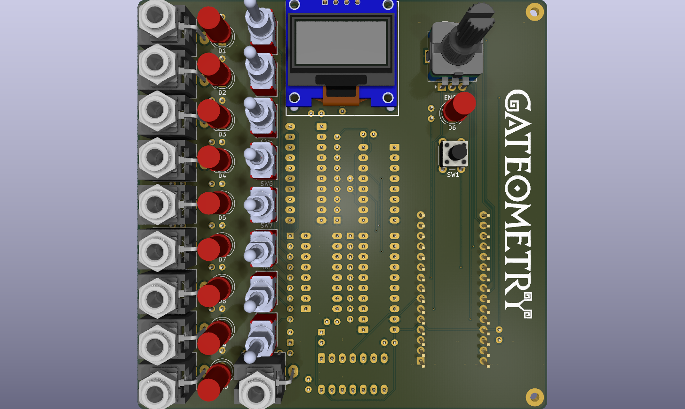
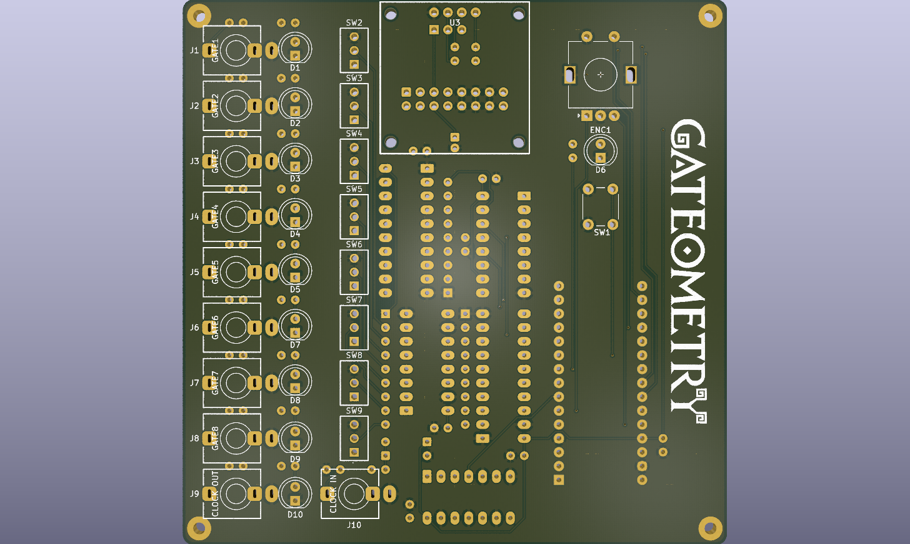
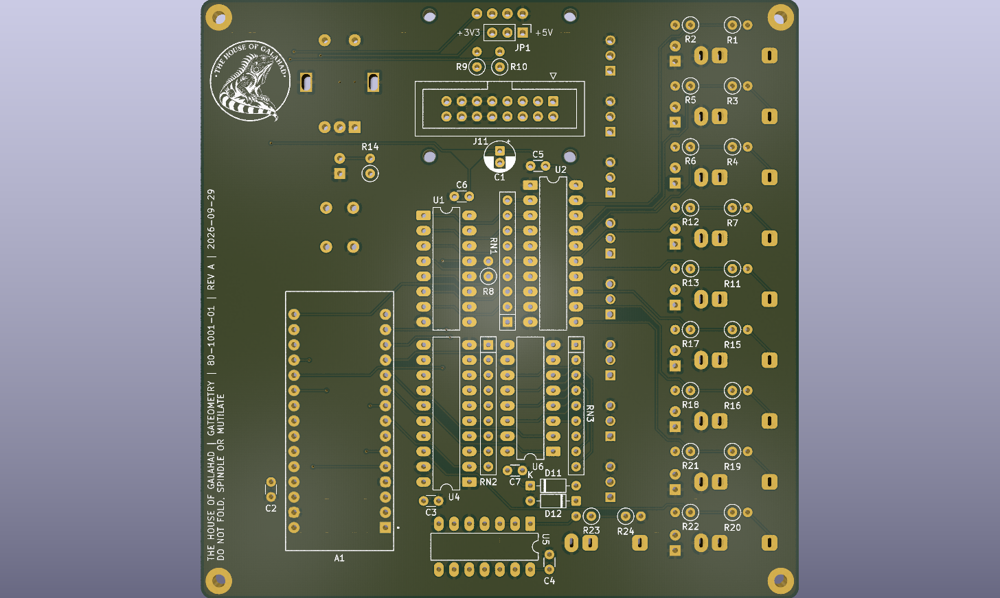

# GATEOMETRY PCB

!Untested!

**Gateometry** is an eight-channel **Euclidean** rhythm generator for **Eurorack** modular synthesizers, built around an **Arduino Nano**. It generates programmable rhythmic gate patterns using the Euclidean algorithm, with independently configurable steps, pulses, rotation, and muting for each channel. The PCB integrates external clock and reset inputs, clock output, eight gate outputs, a rotary encoder for menu navigation, an OLED display, and dedicated run/stop and mute controls. Designed as a flexible platform for rhythmic experimentation, **Gateometry** combines algorithmic pattern generation with hands-on control and external clock synchronization.

## RESOURCES

- [Schematic](schematic.pdf)
- [Assembly](assembly.pdf)
- [Bill of Materials](bom.csv)
- [Interactive Bill of Materials](ibom.html)

## GERBER TO ORDER

- [Default](gerber_to_order/Gateometry_191.3x150.0mm_for_Default.zip)
- [Elecrow](gerber_to_order/Gateometry_191.3x150.0mm_for_Elecrow.zip)
- [FusionPCB](gerber_to_order/Gateometry_191.3x150.0mm_for_FusionPCB.zip)
- [JLCPCB](gerber_to_order/Gateometry_191.3x150.0mm_for_JLCPCB.zip)
- [PCBWay](gerber_to_order/Gateometry_191.3x150.0mm_for_PCBWay.zip)

## RENDERS

